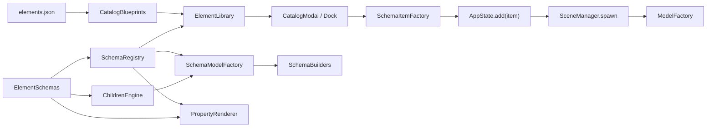

# E-Scale Schema Architecture

## Objetivo

Introducir una capa paramétrica y declarativa sobre el motor actual sin romper el flujo existente de:

- catálogo
- inserción de items
- render 3D / cenital
- panel lateral
- exportación / inventario

La migración se hace por convivencia:

1. los builders legacy siguen funcionando
2. los items con `schemaId` pasan a la nueva arquitectura
3. la UI lateral detecta schemas y se autogenera

---

## Estructura recomendada

```text
src/
├── core/
│   ├── AppState.js
│   └── ElementLibrary.js
├── schemas/
│   ├── CatalogBlueprints.js
│   ├── CatalogCategories.js
│   ├── ChildrenEngine.js
│   ├── ElementSchemas.js
│   ├── ParamDefinitions.js
│   ├── SchemaItemFactory.js
│   ├── SchemaRegistry.js
│   └── SchemaUtils.js
├── models/
│   ├── index.js
│   ├── ...legacy builders
│   └── schema/
│       ├── SchemaBuilders.js
│       └── SchemaModelFactory.js
├── ui/
│   ├── CatalogModal.js
│   ├── Dock.js
│   ├── PropertyRenderer.js
│   └── UIManager.js
└── scene/
    └── SceneManager.js
```

---

## Flujo de datos



---

## Contrato de schema

Cada schema define:

- `id`
- `family`
- `metadata`
- `match(item)`
- `defaults`
- `params`
- `children`
- `builder.preset`
- `ui.dynamic`

Ejemplo de intención:

```js
{
  id: "table.round-banquet",
  family: "table",
  match: item => item.type === "mesa" && item.subtype !== "presi",
  builder: { preset: "roundTableBanquet" },
  defaults: { ... },
  params: [ ... ],
  children: [ ... ]
}
```

---

## Parámetros

Cada parámetro soporta:

- `type`
- `label`
- `default`
- `min`
- `max`
- `step`
- `category`
- `level`
- `visibleIf`
- `onChange`

Y además la capa actual añade:

- `path`
- `read`
- `write`
- `coerce`
- `options`
- `unit`
- `suffix`

Esto permite:

- mapear valores anidados (`dims.width`)
- exponer rotación en grados y guardarla en radianes
- encadenar cambios derivados (`chairs -> count`)

---

## Children auto-generated

El `ChildrenEngine` hoy soporta:

- `around`
- `arc`
- `lateral`
- `grid`
- `stairs`

Casos ya modelados:

- mesa redonda -> sillas automáticas
- buffet -> auxiliares laterales
- escenario -> escalera automática

Patrón:

```js
children: [
  {
    key: "chairs",
    enabledParam: "autoChildren.enabled",
    placement: "around",
    countParam: "chairs",
    offsetParam: "autoChildren.offset",
    childFactory: ({ parentItem, index }) => ({ ... })
  }
]
```

---

## 2D / 3D por vista

La separación no se hace ya con UI hardcodeada sino con `context.view`.

- `SceneManager` pasa `view: "iso"` o `view: "top"`
- `SchemaModelFactory` delega a `SchemaBuilders`
- cada builder decide su representación cenital y volumétrica

Esto permite:

- símbolos 2D limpios en cenital
- volumen simplificado y legible en 3D
- un único item con dos representaciones consistentes

---

## Patrón recomendado para builders

### 1. Builder por preset

Evitar un builder por item comercial. Mejor:

- `roundTableBanquet`
- `chairDining`
- `genericRectProp`
- `genericSurface`
- `genericPerson`
- `genericLighting`

### 2. Items comerciales = datos

Los items del catálogo solo deberían cambiar:

- medidas
- colores
- icono
- label
- schemaId

No deberían duplicar lógica de geometría.

### 3. Hijos como composición, no como mesh hardcodeada

Evitar meter sillas “a mano” dentro del builder de mesa. Mejor:

- builder construye la pieza principal
- `ChildrenEngine` calcula posiciones
- `SchemaModelFactory` compone hijos

---

## Naming conventions

### Schemas

- `table.round-banquet`
- `chair.catering`
- `buffet.station`
- `stage.platform`
- `prop.generic-rect`

### Families

- `table`
- `chair`
- `buffet`
- `stage`
- `prop`
- `surface`
- `person`
- `lighting`

### Catálogo

- `mesa_redonda_18`
- `sofa_3_plazas`
- `generador_electrico`

### Builders

- `roundTableBanquet`
- `genericRectProp`
- `genericLighting`

---

## Buenas prácticas para escalabilidad extrema

1. Mantener `schemaId` estable y exportable.
2. Tratar `elements.json` como catálogo comercial, no como lógica.
3. Concentrar defaults y reglas en schemas JS, no en la UI.
4. Hacer que los children sean declarativos y regenerables.
5. No usar paneles hardcodeados por tipo salvo en legacy temporal.
6. Separar `catalog item`, `runtime item`, `schema`, `mesh builder`.
7. Preparar `schemaVersion` para migraciones futuras de presets/export JSON.
8. Para cientos de objetos, migrar props repetitivos a:
   - instancing
   - geometry caching
   - material pooling
9. Para IA futura:
   - exponer schemas como contrato legible por modelo
   - permitir “crear item por intent” rellenando params
10. Para undo/redo/import/export:
   - persistir solo estado declarativo
   - nunca serializar meshes

---

## Siguiente migración recomendada

1. migrar `mesaRect`, `mesaCocktail`, `mesaImperial`
2. migrar `carpas` a schemas con presets por cubierta
3. unificar inventario/reporting por `schema.family`
4. añadir presets guardables por schema
5. introducir `schemaVersion` en exportaciones
6. crear `BehaviorRegistry` para acciones complejas desacopladas

---

## Estado tras esta iteración

Ya queda operativo:

- catálogo ampliado por categorías
- schemas reutilizables
- UI lateral dinámica para items schema-driven
- builders 2D/3D por preset
- children automáticos declarativos
- compatibilidad con builders legacy

Es una base comercial razonable para seguir migrando sin “big bang”.
